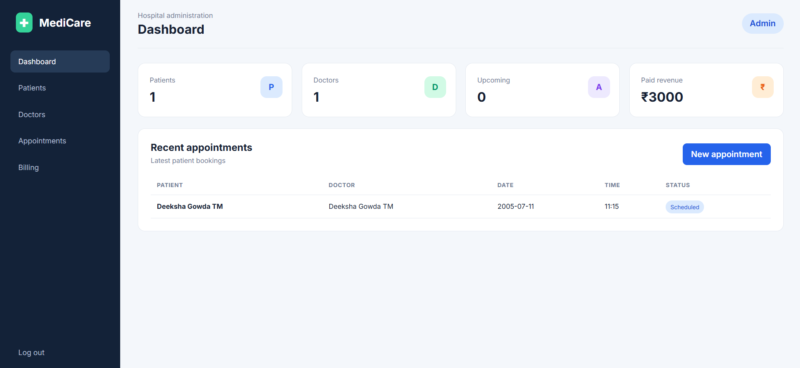
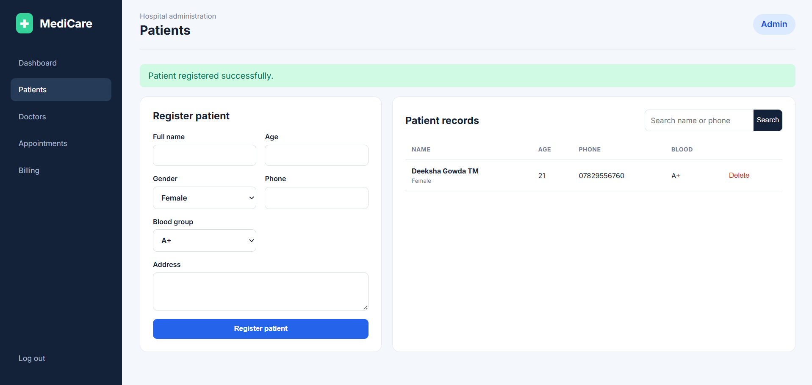
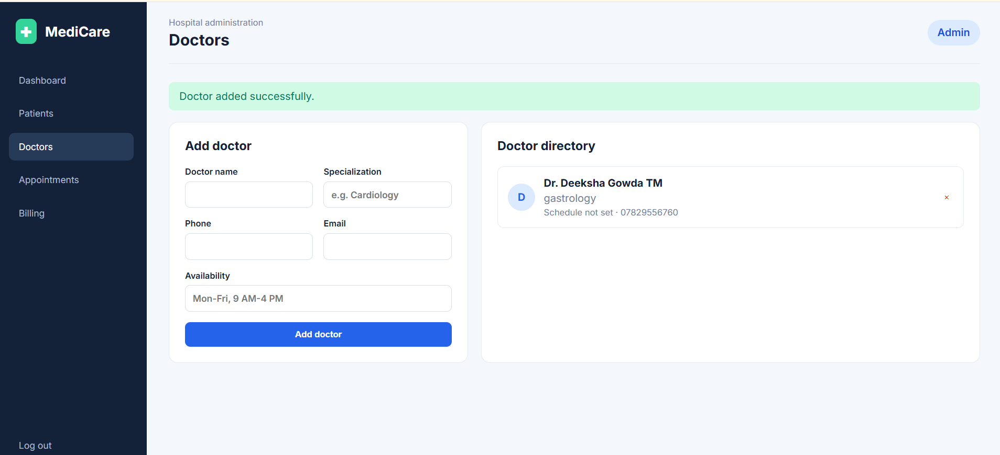
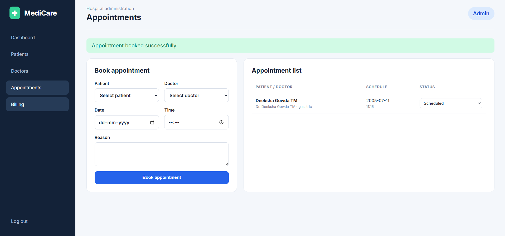
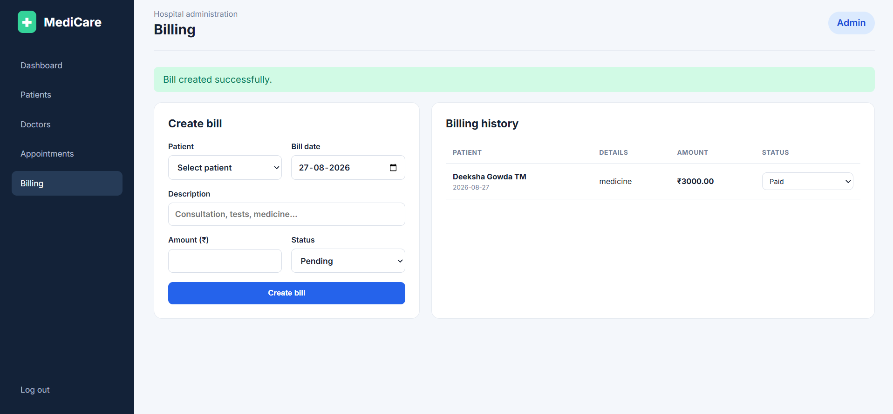

# MediCare Hospital Management System

A responsive Flask and SQLite web application for managing patients, doctors, appointments, and hospital billing.

## Features

- Secure administrator login
- Dashboard with live statistics
- Patient registration, search, and records
- Doctor directory and availability
- Appointment booking and status updates
- Billing and payment tracking
- Responsive interface for desktop and mobile

## Run locally

```bash
python -m venv .venv
# Windows: .venv\Scripts\activate
# macOS/Linux: source .venv/bin/activate
pip install -r requirements.txt
flask --app app init-db
flask --app app run
```

Open `http://127.0.0.1:5000`. Demo login: `admin` / `admin123`.

For production, set a strong `SECRET_KEY` environment variable and change the default administrator password.

## Technologies

Python, Flask, SQLite, HTML, CSS, Jinja2, Werkzeug, Gunicorn.

## Author

Deeksha TM


## Project Screenshots

### Dashboard



### Patient Management



### Doctor Management



### Appointment Booking



### Billing Management


